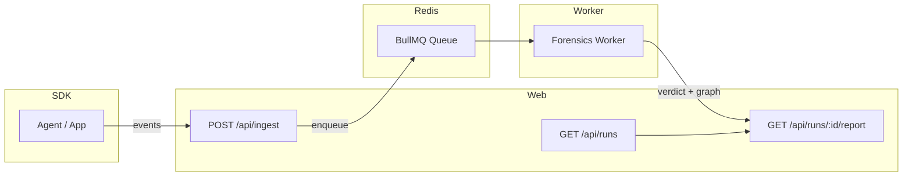

# FaultLine

**Root-cause analysis for AI decisions.**

Flight recorder + forensics engine for agentic / AI-driven systems. Capture every step, then produce an evidence-backed incident report: timeline → root cause → contributing factors → fixes.

---

## Architecture



---

## Monorepo

- **apps/web** — Next.js (Ingest API + Report UI)
- **apps/worker** — BullMQ worker (forensics pipeline)
- **packages/sdk** — instrumentation SDK
- **packages/shared** — event schemas + shared types

---

## Quick start

```bash
npm install
cp .env.example .env
```

Edit `.env`. Then:

```bash
docker compose up -d
npm run build
npm run dev:web
```

In another terminal:

```bash
npm run dev:worker
```

- **UI:** http://localhost:3000
- **Runs:** http://localhost:3000/runs

Each app has its own `.env.example`; copy to `.env` where needed.

## Demo Setup

After starting services, seed demo data:

```bash
npm run seed
```

This creates two demo traces:

- `demo-bad-run`: Failed flight booking (tool error)
- `demo-fixed-run`: Successful flight booking

See `DEMO.md` for the 3-minute demo script.

## Integration

### For Developers: Integrate FaultLine into Your AI Agent

Use the FaultLine SDK to instrument your AI agent system:

```bash
npm install github:ashutosh887/FaultLine#packages/sdk
```

```typescript
import { Tracer } from "@faultline/sdk";

const tracer = new Tracer({
  ingestUrl: "https://your-faultline-app.vercel.app",
});

// Emit events at key points
tracer.emit({
  type: "user_input",
  payload: { text: "Book a flight..." },
});

tracer.emit({
  type: "tool_call",
  payload: {
    tool_name: "flight_search",
    input: { origin: "NYC", destination: "LAX" },
  },
});
```

**📖 Full integration guide:** 
- **In-app docs:** Visit `/docs` on your deployed FaultLine instance
- **GitHub:** See [`INTEGRATION.md`](./INTEGRATION.md) for complete documentation
- Integration examples (LangChain, OpenAI, custom agents)
- Event types and best practices
- API integration (without SDK)

**🚀 Deployment:** See [`DEPLOYMENT.md`](./DEPLOYMENT.md) for production setup.

---

## Gemini Integration

FaultLine uses **Gemini 3** for automated root-cause analysis. See `GEMINI_INTEGRATION.md` for details.
