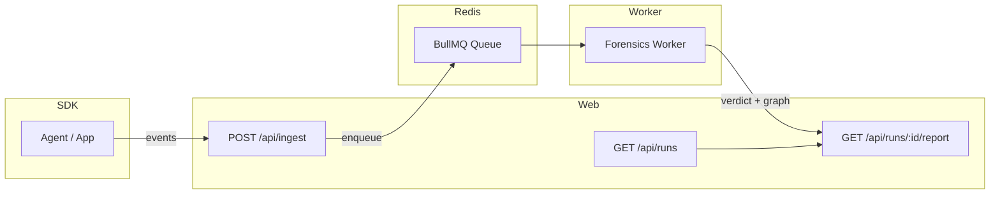

# FaultLine

**Root-cause analysis for AI decisions.**

Flight recorder + forensics engine for agentic / AI-driven systems. Capture every step, then produce an evidence-backed incident report: timeline → root cause → contributing factors → fixes.

---

## Architecture



---

## Monorepo

- **apps/web** — Next.js (Ingest API + Report UI)
- **apps/worker** — BullMQ worker (forensics pipeline)
- **packages/sdk** — instrumentation SDK
- **packages/shared** — event schemas + shared types

---

## Quick start

```bash
npm install
cp .env.example .env
```

Edit `.env`. Then:

```bash
docker compose up -d
npm run build
npm run dev:web
```

In another terminal:

```bash
npm run dev:worker
```

- **UI:** http://localhost:3000
- **Runs:** http://localhost:3000/runs

Each app has its own `.env.example`; copy to `.env` where needed.
